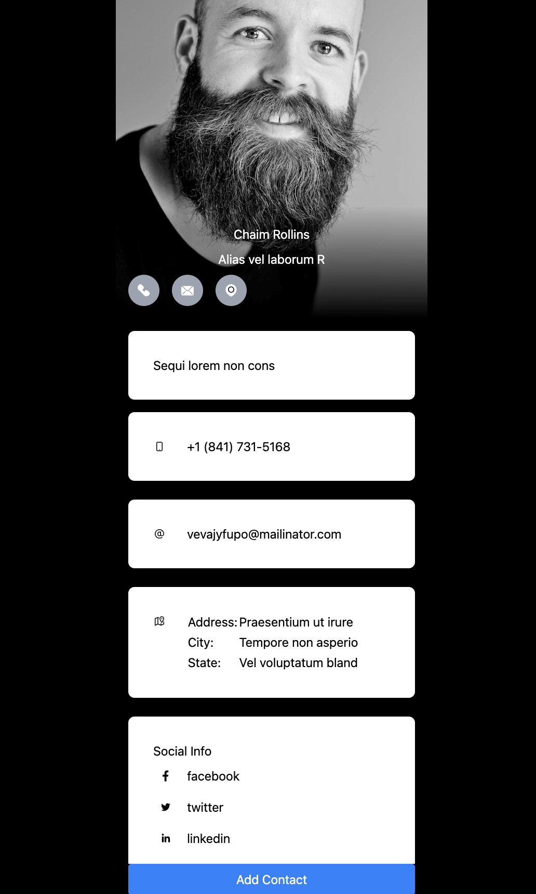
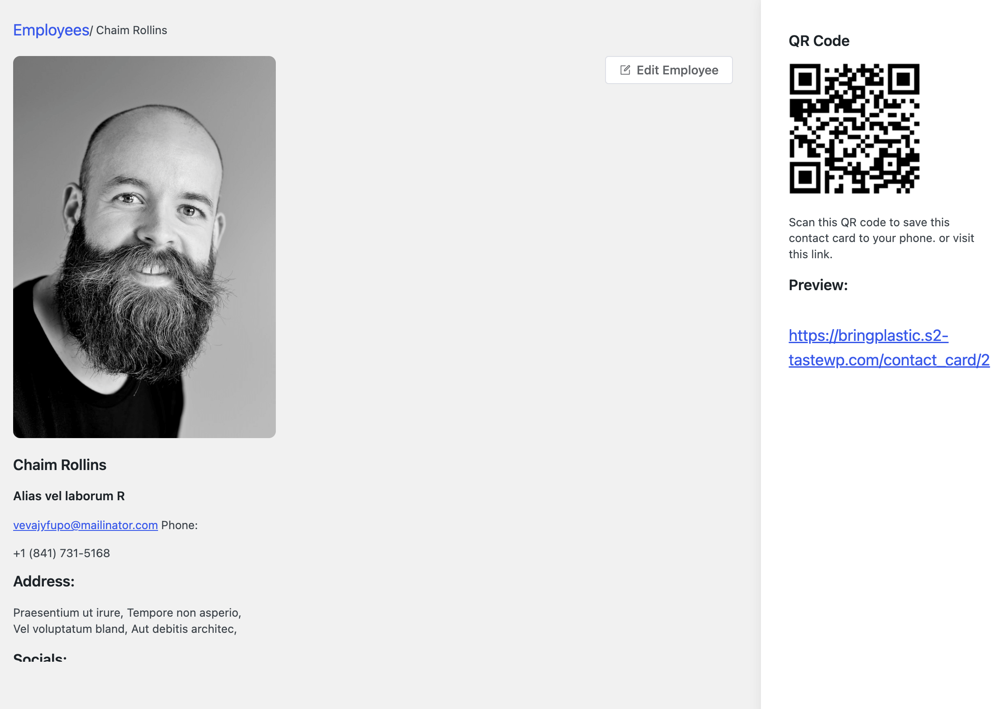

# Employee Contact card generator and vcf contact downloader
# Plugin name : Employee Card

# Frontend:

# How to use ?

- Just clone/fork this repository
- Check the package.json file
- command: `npm i`
- command: `npm run watch` for development and for production: `npm run production`

If you face any issue feel free to let me know. :)

 
